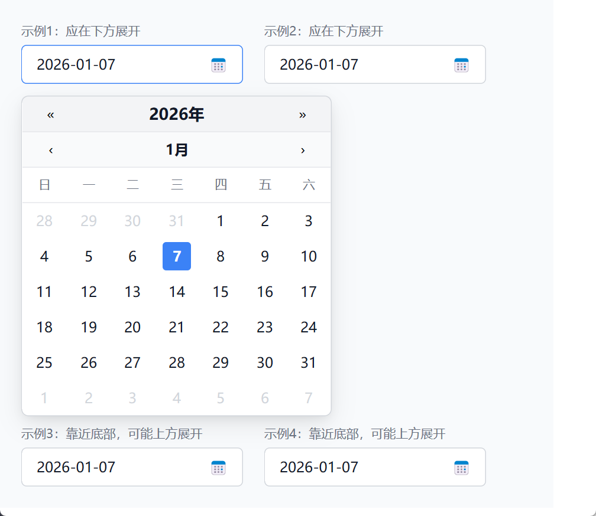
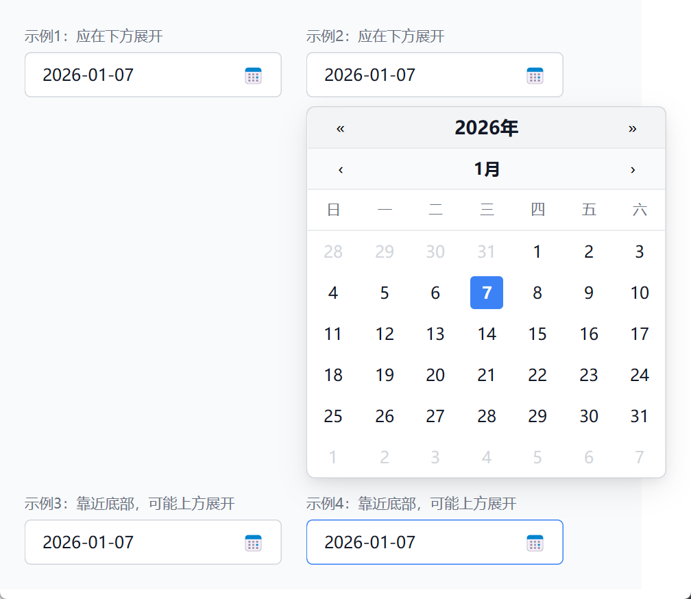

<table>
  <tr>
    <td></td>
    <td></td>
  </tr>
</table>

以下是本次实现日历组件（带弹出日历选择）的思路梳理：

1) 基础状态与结构
- 定义 Calendar：current_month、selected_date，提供 prev/next 月、prev/next 年、获取月份日期列表、判断今日/选中/当月等方法。
- 定义 DatePicker：包含 Calendar、本地弹出状态 is_open、显示方向 show_above。
- 定义 AppView：管理多个 DatePicker，便于在不同位置测试弹层展开方向与遮挡。

1) UI 触发与显示
- 输入框触发器：显示选中日期或占位文案，点击切换 is_open。
- 悬浮日历：绝对定位在输入框下方或上方，间距用输入框高度 + 间距（40+40=80）来避免遮挡；上方则用 bottom 偏移同样的距离。
- 多实例布局：父容器使用 flex + wrap，配合不同的 offset_top 演示上下展开的差异。

1) 弹层方向与避障
- 简化逻辑：根据所在行控制 show_above（上排向下，下排向上）。如需动态计算，可在点击时用窗口高度和输入框位置估算上/下可用空间，决定 show_above。
- 弹层尺寸：约 320px 高度（3 个 40px 标题栏 + 6 行 40px 日期行），用以判断空间。

1) 交互细节
- 日期选择：点击当前月日期，设置 selected_date，并关闭弹层。
- 外部点击关闭：当任一弹层打开时渲染一个透明全屏遮罩，点击遮罩关闭所有弹层。
- 按钮交互：年份左右按钮、月份左右按钮均更新状态后 cx.notify() 触发重渲染。

1) 样式要点
- 行高统一：年份栏、月份栏、星期标题栏均 40px；日期单元行高 40px，内部按钮 32px。
- 色彩：选中为蓝底白字，今日为淡蓝底或蓝字，非当月日期灰色。
- 输入框：边框、圆角、hover 改边框色，右侧图标。

1) 改进方向（可选）
- 恢复动态避障：在点击时调用 calculate_position，基于窗口可用空间决定 show_above。
- 动画/过渡：为弹层增减透明或位移动画。
- 可访问性：为按钮添加键盘导航、focus 样式，或提供 tab_index。
- 重用与抽象：将日历渲染部分拆成独立函数或组件以便复用。